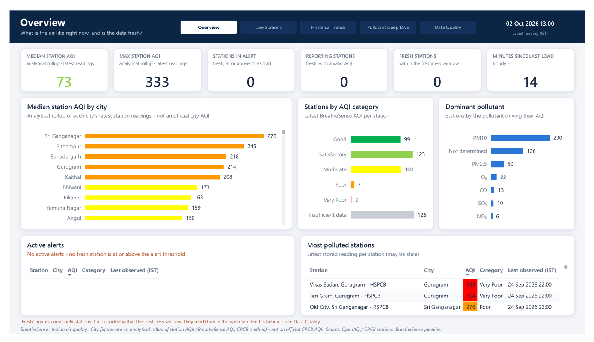
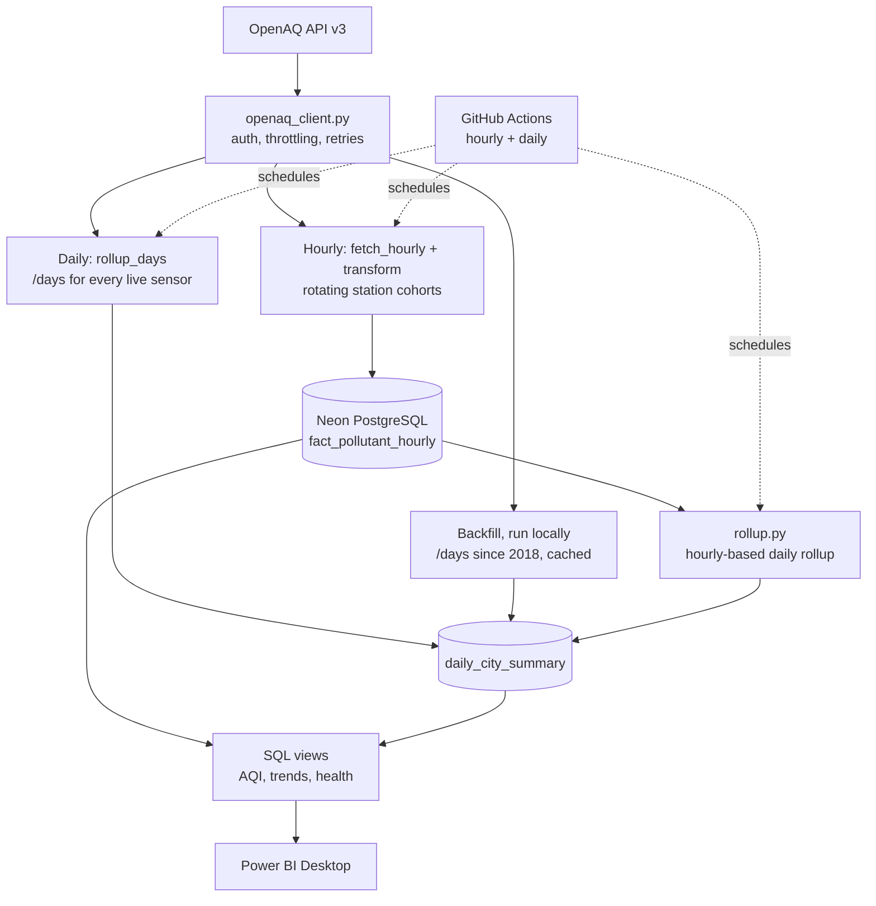
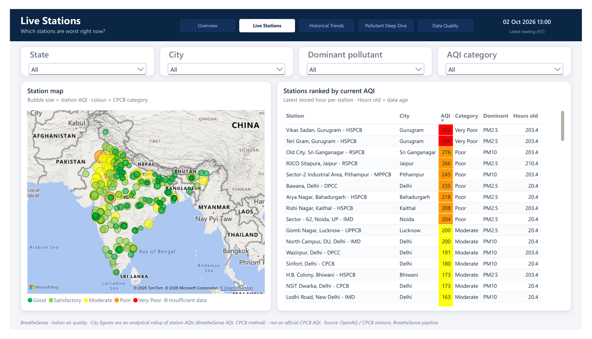
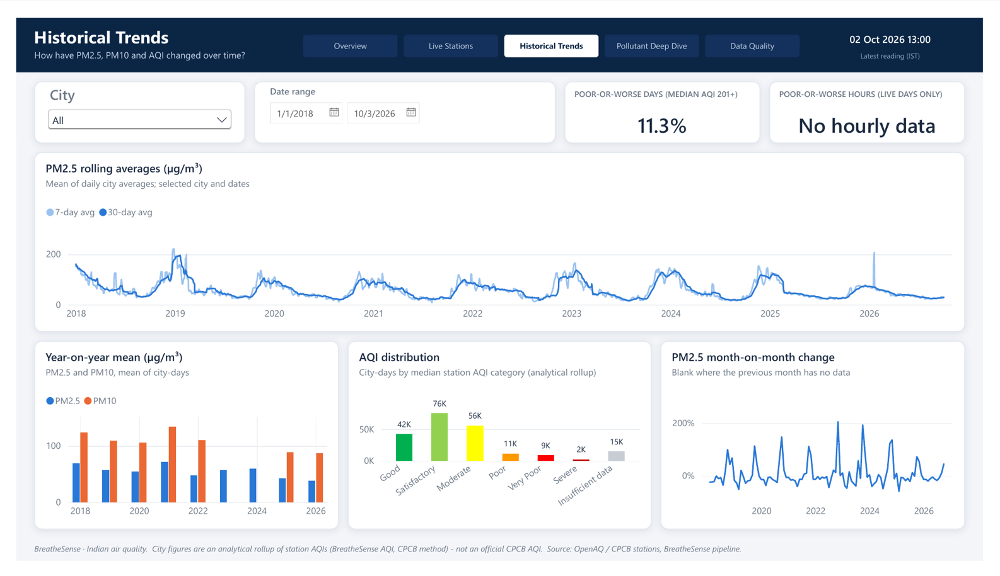
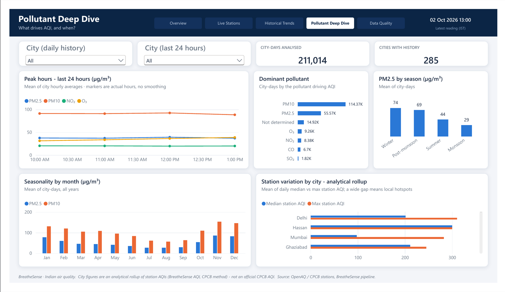
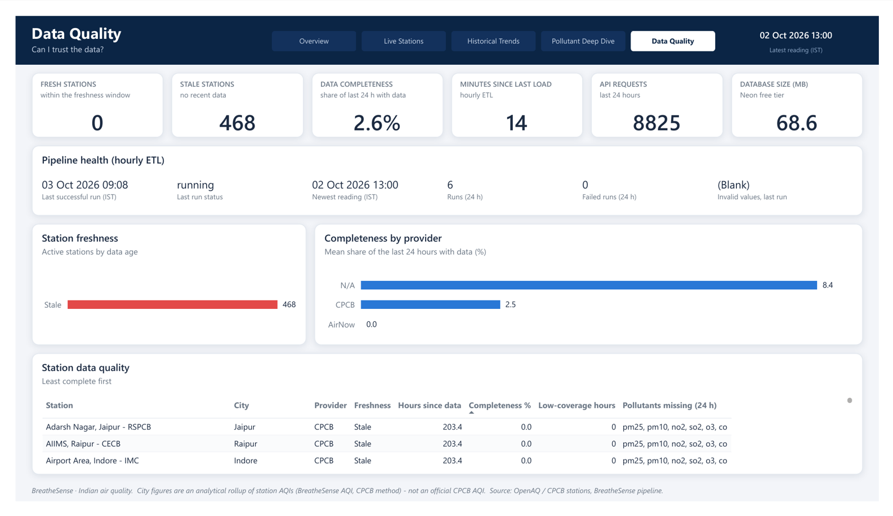

<div align="center">

# BreatheSense

**Automated air-quality data engineering and analytics for India**

[](https://github.com/OmkarJayvantJadhav/breathesense/actions/workflows/hourly_etl.yml)
[](https://github.com/OmkarJayvantJadhav/breathesense/actions/workflows/daily_rollup.yml)


[](LICENSE)



</div>

An automated **air-quality data engineering and analytics platform for India**. It ingests real
monitoring data from the OpenAQ API, validates and standardizes it with Python, stores it in PostgreSQL,
calculates an Indian National AQI implementation in both Python and SQL, and exposes live and historical
insight through a Power BI dashboard. It runs on free tiers only (GitHub Actions + Neon PostgreSQL).

> **BreatheSense AQI (CPCB method)** follows the CPCB National AQI methodology but is **not an official CPCB AQI**.
> City figures are an *analytical rollup of station AQIs* (median and max), never an official city AQI.

## Contents

[Questions it answers](#questions-it-answers) ·
[Numbers](#numbers-verified-2026-10-02) ·
[Architecture](#architecture) ·
[Data flow](#how-the-data-flows) ·
[Database](#database-design) ·
[AQI method](#the-aqi-method) ·
[Data quality](#data-quality) ·
[Findings](#what-the-history-shows) ·
[Dashboard](#dashboard) ·
[Setup](#setup) ·
[Limitations](#limitations) ·
[Structure](#project-structure) ·
[License](#license)

## Questions it answers

1. What is the latest air quality at monitored stations?
2. Which pollutants drive the current AQI?
3. How have PM2.5 and PM10 changed over time?
4. What are the daily and seasonal patterns?
5. What changes are visible around events such as Diwali?
6. How complete and fresh is the underlying monitoring data?
7. Is the pipeline working reliably?

## Numbers (verified 2026-10-02)

| Metric | Value |
|---|---|
| Monitoring locations (reference monitors) | 642, of which 468 active, mapped to 286 city+state keys |
| Daily city history | 210,791 city-days for 286 cities, 2018-01-01 to 2026-10-01 |
| History source | OpenAQ `/days` for 5,445 sensors; legacy series 2018-2022, current series 2025-2026, sparse 2023-24 (five metros) |
| Automated runs recorded | 19 hourly ETL runs and 7 daily rollups, all successful |
| Tests | 343 unit tests (no network, no database) plus an opt-in integration test that checks Python and SQL AQI agree |
| Database size | 67 MB of the 512 MB free tier |

## Architecture



Raw JSON is not archived. Only validated, standardized values reach the database, and rejected values are
counted and logged, never silently dropped.

## How the data flows

- **Hourly (`hourly_etl.yml`).** `/sensors/{id}/hours` is the only source of true hourly means. The live
  sensors of active stations are split into six cohorts by `location_id % 6`. Each run fetches one cohort over
  a 9-hour trailing window (at most about 485 requests, under the 600 budget) and upserts a wide row per
  station and hour. A station whose newest stored hour is older than the window is fetched from that hour
  instead (up to 7 days back, at no extra request cost), so hours that OpenAQ publishes late, or that a
  skipped GitHub run missed, are filled in on the next run instead of leaving a gap.
- **Daily (`daily_rollup.yml`).** Syncs locations and sensors, then runs `rollup_days` (yesterday's `/days` for
  every live sensor, about 2,700 requests at 30 per minute), then the hourly-based `rollup`, applies retention
  and commits `last_run.json`. That commit also keeps the scheduled workflows alive: GitHub disables
  schedules in public repos after 60 days without activity.
- **Backfill (`scripts/backfill_history.py`, local only).** Resumable, rate-limited and idempotent. It caches
  raw daily series locally (gitignored) and writes only city-day aggregates to Neon. Several workers can run side by side
  under a combined throttle cap.

All OpenAQ traffic goes through one client with a fixed minimum interval between requests, retries with backoff
for 429 and 5xx, finite timeouts and a hard per-run request budget. The two workflows share a concurrency group
so they never call the API at the same time.

## Database design

| Table | Purpose |
|---|---|
| `dim_location`, `dim_sensor` | Stations (city, state, gas-unit convention, active flag) and their sensors (`is_live` marks the series used for ingestion) |
| `fact_pollutant_hourly` | Hourly concentrations in standard units, one row per `(location_id, reading_time)`; 30-day retention |
| `daily_city_summary` | Daily city rollups, keyed `(city, state, summary_date)`, kept forever; `source` is `live_rollup` or `backfill` |
| `ref_aqi_breakpoints`, `ref_settings` | The AQI breakpoints (loaded from `data/ref_aqi_breakpoints.csv`) and thresholds, so SQL and Python use identical values |
| `dim_date` | Calendar with season (winter, summer, monsoon, post-monsoon) and Diwali dates |
| `pipeline_log`, `backfill_progress`, `alert_log` | Run metrics, backfill progress, alert cooldowns |

Every loaded table has a primary key and is loaded with `ON CONFLICT`, so any run can be repeated safely.
**Seven views** feed the dashboard: `vw_location_aqi_now`, `vw_city_latest`, `vw_last_24h`, `vw_active_alerts`,
`vw_city_daily_all`, `vw_data_quality`, `vw_pipeline_health`. AQI is computed in SQL functions over the
breakpoints table. Ten analysis queries (`sql/03_analysis.sql`) each state a business question and the SQL
concept they show: percentiles, rolling window frames, `LAG()`, ranking, CTEs with the Diwali window,
conditional aggregation and more.

## The AQI method

- Eight CPCB pollutants are supported. PM2.5, PM10, NO2, SO2 and NH3 use 24-hour means; O3 and CO use trailing
  8-hour means. The overall AQI is the worst sub-index, valid only with at least three pollutants including PM2.5
  or PM10 (project rule: 18 of 24 hourly values, 6 of 8 for the 8-hour windows).
- The published breakpoint tables have gaps; bands are treated as contiguous and the top band extrapolates with the
  previous band's slope, capped at 500. The breakpoints file was cross-checked against the CPCB document.
- Python (`src/aqi.py`) and SQL give the same result; an integration test compares them on a dense grid for every
  pollutant and on every station.

## Data quality

- **Units.** OpenAQ labels the current CPCB gas series `ppb`, but the real unit differs by station. Each station's
  convention (`ugm3`, `ppb` or `unclassified`) is classified from the identity `NOx = NO + NO2`. NO2 at `ppb` stations is
  converted; SO2 and CO there are rejected because their unit could not be verified; gases at `unclassified`
  stations are rejected. The AQI then uses PM2.5, PM10 and O3.
- **Validation.** Missing, non-finite, negative and implausible values are excluded and counted per reason in
  `pipeline_log`: PM above 1,500 µg/m³, and gases above five times the lower bound of the CPCB "Severe" band
  (for example NO2 above 2,000 µg/m³), which catches corrupt values such as NO2 of 4×10²⁰.
- **Completeness.** A station-day counts only with at least 18 hourly values. For the `/days` data it must also have
  observations spread over the day, because the legacy series report sub-hourly or duplicate readings (62% of legacy
  sensor-days show more than 24 "observations").
- **Cross-checks.** On the days where both exist, the backfill's daily means agree with the live hourly pipeline to a
  median 0.07% (179 station-days with equal hour counts).
- **Observability.** `vw_pipeline_health` and `vw_data_quality` show the last successful run, minutes since the last
  load, fresh and stale stations, completeness and invalid counts. The dashboard's Data Quality page reads them.

## What the history shows

Daily city-average PM2.5 (µg/m³), from the backfilled data:

- **Seasonality, 2018-2022 (median city-day):** winter 68.6, post-monsoon 57.4, summer 41.6, monsoon 24.9.
- **Lockdown:** Delhi's April 2020 mean was 45.8, against 78.8-79.9 in April 2018, 2019 and 2021.
- **Diwali:** Delhi PM2.5 peaks on Diwali day or the day after in 2018, 2019, 2020, 2021, 2023 and 2025 (for example
  479 the day after Diwali 2018, 487 in 2021 and 261 on 21 October 2025). In 2024, when the festival was split across
  31 October and 1 November, the peak came about three days later (218 on 4 November), and the Diwali days themselves are
  missing from the 2022 data.

## Dashboard

The dashboard is built in Power BI Desktop on top of the seven views (Import mode). It is saved as a Power BI
project (`powerbi/BreatheSense.pbip`, text files that diff cleanly in git); the `.pbix` is gitignored.
`powerbi/theme.json` carries the CPCB category colors and `powerbi/dax_measures.txt` the measures. City figures
are labelled as an analytical rollup throughout, and empty or stale panels say why they are empty.

### Overview
*Is the air bad right now, and is the data fresh?* Headline AQI tiles, city ranking, AQI categories, dominant pollutants and active alerts.


### Live Stations
*Which stations are worst right now?* A map of every station, coloured by CPCB category and sized by AQI, next to a ranked table with data age.



### Historical Trends
*How have PM2.5, PM10 and AQI changed since 2018?* Rolling averages, year-on-year means, AQI distribution and month-on-month change.



### Pollutant Deep Dive
*What drives AQI, and when?* Dominant pollutants, peak hours, seasonality and the gap between median and worst station per city.



### Data Quality
*Can I trust the data?* Freshness, completeness by provider, pipeline health and per-station quality.



## Setup

Requires Python 3.11+, a free [OpenAQ API key](https://docs.openaq.org) and a free Neon PostgreSQL project.

```powershell
python -m venv .venv
.venv\Scripts\activate
pip install -r requirements.txt
copy .env.example .env        # then set OPENAQ_API_KEY and DATABASE_URL
```

Secrets are read only from environment variables or `.env` through `src/config.py` and are never logged. In GitHub
Actions they come from repository secrets (`OPENAQ_API_KEY`, `DATABASE_URL`).

```powershell
python -m scripts.init_db            # schema, views, breakpoints, calendar, festivals
python -m src.sync_locations         # stations and sensors
python -m scripts.seed_recent        # last 48 h so rolling AQI works at once
python -m src.main                   # one hourly ingestion run
python -m src.rollup_days            # yesterday's /days rollup
python -m src.rollup                 # hourly-based rollup + retention
python -m scripts.backfill_history --estimate     # then --fetch, --aggregate --dry-run, --aggregate
pytest -v                            # unit tests; add -m integration with TEST_DATABASE_URL set
```

## Limitations

- **Not an official AQI.** City figures are medians and maxima of station AQIs.
- **Live freshness depends on OpenAQ.** The CPCB feed on OpenAQ often runs one to several days behind (up to about
  eight days in early October 2026). The pipeline reports stations as stale instead of inventing data, and the
  catch-up window fills the missing hours once OpenAQ publishes them.
- **GitHub's schedule is throttled.** The "hourly" job ran about four times a day, so hourly data alone rarely gives
  18 complete hours per station. Daily city history therefore comes from `/days`; live "now" views can be patchy.
- **Daily-mean approximations.** City-days built from `/days` use the daily mean for O3 and CO instead of the
  8-hour maximum, and have no hourly metrics (`o3_co_approximated` marks them).
- **Gas units.** SO2 and CO at `ppb`-classified stations are excluded (their unit is unverified); about 160 stations are
  `unclassified` and report no gases. This affects pollutant averages more than the AQI, which PM usually dominates.
- **Gaps in history.** There is almost no CPCB data on OpenAQ for 2023-2024 (five metros only), and the completeness
  check cannot see gaps inside a day's observation span.
- **City mapping.** Cities come from a deterministic parser plus reviewed overrides in `data/city_mapping.csv`; 14
  monitors stay unmapped and are excluded from city rollups. City names repeat across states, so city and state are
  always used together.
- **Free tiers.** Neon Free has 0.5 GB of storage and a monthly compute allowance; the hourly rows are kept 30 days.

## Project structure

```text
src/        openaq_client, units, validation, aqi, transform, fetch_hourly, load, main,
            rollup, rollup_days, days_rollup (shared /days rules), sync_locations, city_mapping
scripts/    explore_api, init_db, seed_recent, backfill_history, classify_units, generate_city_mapping,
            repair_gas_caps (one-off repair of stored values over the gas caps)
sql/        01_schema.sql, 02_views.sql, 03_analysis.sql
data/       ref_aqi_breakpoints.csv, city_mapping*.csv, unit_convention.csv, festivals.csv
tests/      unit tests with trimmed real API payloads as fixtures; tests/integration for Python vs SQL AQI
powerbi/    BreatheSense.pbip (+ .Report and .SemanticModel folders), theme.json, dax_measures.txt
docs/       openaq_exploration.md (verified API behaviour and design decisions), images/ (dashboard screenshots)
.github/    hourly_etl.yml, daily_rollup.yml
```

`docs/openaq_exploration.md` records what the API really returns (units, pagination, rate limits, coverage semantics,
benchmarks) and why each design decision was made.

## Attribution

Air-quality data comes from [OpenAQ](https://openaq.org) and its underlying providers, here the Central Pollution
Control Board (CPCB) and state pollution control boards. See OpenAQ's terms for provider-specific licensing. The AQI
follows the CPCB National Air Quality Index methodology; this project is independent and not affiliated with CPCB or OpenAQ.

## License

Code released under the [MIT License](LICENSE). Air-quality data remains subject to OpenAQ's and the providers' terms (see Attribution).
